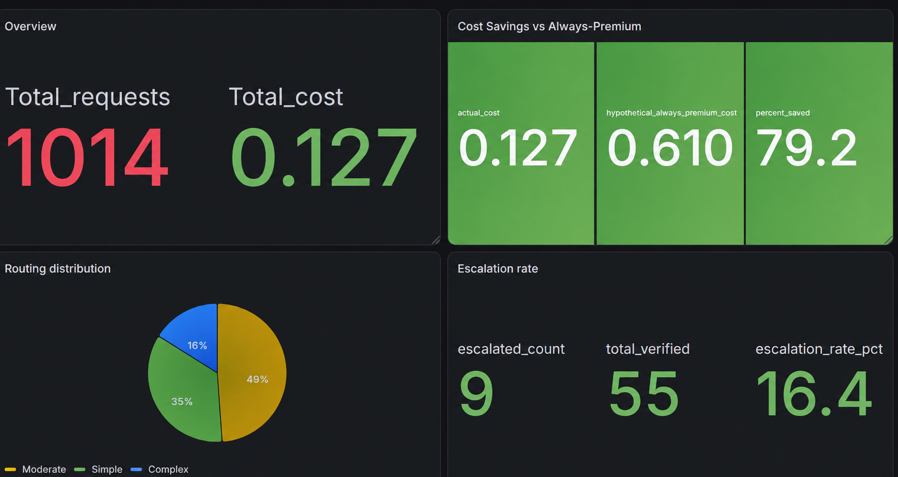
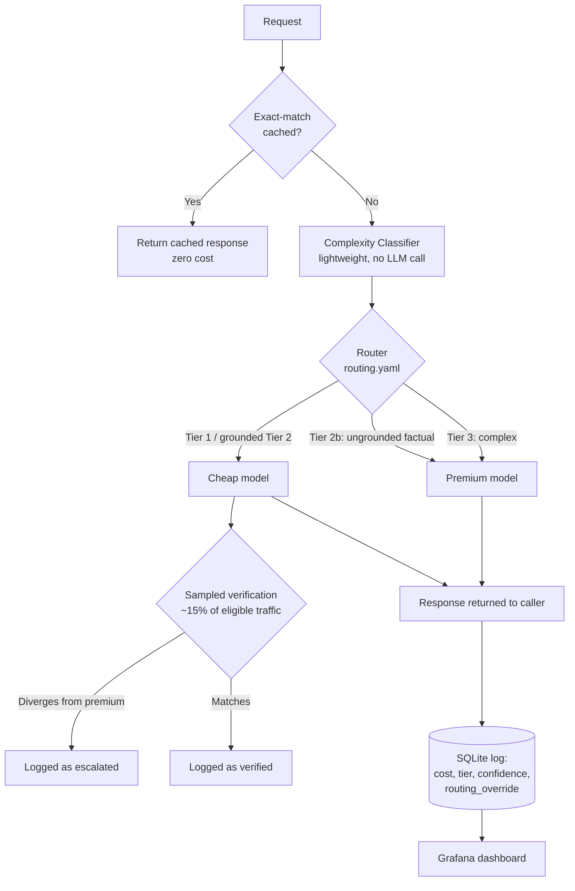

**LLM Cost Autopilot**


An intelligent routing layer for LLM applications that classifies incoming requests by complexity, routes each one to the most cost-appropriate model, and continuously verifies output quality, cutting inference costs without sacrificing reliability.

**Overview**

Most applications that use LLMs send every request to the same model, regardless of whether the task is trivial or complex. LLM Cost Autopilot solves this by inserting an intelligent routing layer between the application and the model providers: a lightweight, non-LLM classifier scores request complexity in milliseconds, a configurable router sends the request to the appropriate model tier, and an asynchronous verification loop checks that routing decisions are producing quality output, logging any that aren't.

**Results**

| Metric | Result |
|---|---|
| Cost savings vs. always using a premium model | **79.2%** (1,014 requests, $0.127 actual vs. $0.610 hypothetical) |
| Complexity classifier accuracy (5-fold cross-validated) | **83.88%** |
| Escalation rate (sampled, in-production traffic) | 16.4% (9 of 55 verified requests) |
| Test coverage | **94 automated tests**, CI-verified |

**Live dashboard reflecting the results above**


**How it works**



**Note:** verification (the sampled check comparing cheap vs. premium) runs asynchronously *after* the response is already returned, so it never adds latency to what the caller receives.

**Classification.** Every incoming request is scored by a Random Forest classifier trained on 223 labeled examples spanning three complexity tiers (simple extraction/Q&A, moderate summarization/analysis, complex multi-step reasoning and creative generation). Classification uses lightweight text features, no LLM call required, so routing decisions add negligible latency and zero additional cost. Classifier confidence is logged alongside every prediction.

**Routing.** A YAML configuration file maps each complexity tier to a specific model and provider. Routing logic is fully decoupled from provider implementation: adding a new model from an already-integrated provider requires only a config change, and adding an entirely new provider requires a single small adapter module following an established pattern, with no changes to the classifier, verification, logging, or API layer.

**Caching.** Identical prompts are served from a response cache at zero cost and near-zero latency, rather than being recomputed against a live provider.

**Verification.** A sampled percentage of eligible traffic is independently re-answered by the premium model and compared against the original response using an LLM-as-judge evaluation, with the premium model also serving as judge. Verification is deliberately scoped to only the tiers where a genuine capability gap exists between the responding model and the judge model. Requests already routed to premium are excluded, since comparing a model's output to itself provides no useful signal.

**Observability.** Every request is logged with cost, latency, tier, classifier confidence, verification outcome, and routing overrides, with prompt content hashed rather than stored in plaintext. A live Grafana dashboard surfaces cost savings, routing distribution, and quality metrics in real time.

**Reliability.** Provider rate limits are handled with automatic retry-and-backoff and clean HTTP semantics (429, not a raw failure). `/health` and `/ready` endpoints support standard deployment tooling.

**Deployment.** The full system is exposed as a REST API via FastAPI and packaged as a Docker container for portable, one-command deployment.

**API**

| Endpoint | Description |
|---|---|
| `POST /v1/completions` | Primary endpoint. Caller submits a prompt; the router selects the model. |
| `GET /v1/models` | Lists configured models and their routing tiers. |
| `GET /v1/stats` | Returns aggregate cost, usage, cache, and quality statistics. |
| `PUT /v1/routing-config` | Updates routing configuration at runtime. |
| `GET /health` / `GET /ready` | Liveness and readiness checks for deployment tooling. |

Interactive API documentation is available at `/docs` once running.

**Tech stack**

Python · FastAPI · scikit-learn · SQLite · Grafana · Docker · Groq / Anthropic / OpenAI

**Getting started**

```bash
pip install -r requirements.txt
echo "GROQ_API_KEY=your_key_here" > .env
uvicorn src.api.main:app --reload
```

Or with Docker:

```bash
docker build -t llm-cost-autopilot .
docker run -d -p 8000:8000 --env-file .env -v "${PWD}/data:/app/data" llm-cost-autopilot
```

Run the test suite:

```bash
pytest tests/ -v
```

**Project structure**

```
llm-cost-autopilot/
├── config/
│   └── routing.yaml            # Model definitions, tier routing, verification settings
├── data/
│   ├── prompts_labeled.csv     # Training dataset for the complexity classifier
│   └── *_results.json          # Raw output from the investigations described below
├── src/
│   ├── models/                 # Provider-agnostic model interface (Groq, Anthropic, OpenAI)
│   ├── classifier/              # Complexity classification
│   ├── verification/            # Asynchronous quality verification
│   ├── logging/                 # Request logging and response caching
│   ├── router/                  # Configuration resolution
│   └── api/                     # FastAPI application
├── scripts/                     # Load testing and investigation tooling
├── tests/                       # 94 automated tests
├── build_dataset.py             # Regenerates the labeled training dataset
└── Dockerfile
```

**Investigating a real reliability gap**

An initial verification comparison tested an LLM-as-judge approach against a similarity-based (TF-IDF) approach on 30 prompts mixing all three complexity tiers together. LLM-judge correctly cleared 100% of accurate responses, versus a 30% false-flag rate for similarity-based scoring. The 0% escalation rate on this mixed sample masked a meaningful difference by tier, though. A follow-up check isolating 30 Tier 2 (moderate-complexity) prompts specifically found a **23.3% escalation rate**.

Manual review of the escalated cases showed two distinct patterns:

- **Stylistic divergence, not a real quality problem.** Asked to draft an email to a hackathon organizer, the cheap model produced a complete, usable template, while the premium model asked clarifying questions before committing to an answer. This is a difference in approach, not correctness.
- **Genuine fabrication.** Asked for niche admission statistics for a specific institution, the cheap model stated it lacked the data, then generated specific-looking numbers anyway.

To quantify the second pattern, the same niche factual query was run 10 times against the cheap model in isolation: **9 of 10 runs produced fabricated, specific-sounding statistics; 1 of 10 correctly declined to answer.** The same query was then run against the premium model, which also fabricated, confirming that model comparison alone cannot guarantee correctness on queries neither model has real grounding for.

**Mitigation implemented:** Tier 2 requests are further classified as grounded or ungrounded. Ungrounded factual queries (the pattern shown above to fail most often) are routed directly to the premium model rather than the cheap tier, with the override recorded in the database (`routing_override`) for full traceability between the classifier's raw prediction and the actual routing decision applied.

This mitigation reduces exposure to the specific failure pattern identified above; it does not guarantee factual correctness, since even the premium model fabricated on the same query. This is treated as a disclosed, scoped limitation rather than a solved problem, see Roadmap.

**Design notes**

**Provider-agnostic by design.** `src/router/config_loader.py` builds model configurations directly from `routing.yaml`, including provider, pricing, and capability tier, so no code changes are required to add a new model on an already-integrated provider. Groq is verified at production scale (1,000+ live requests); Claude and OpenAI adapters are implemented, unit-tested, and wired into routing, but not yet verified against a live call.

**Verification is sampled and scoped, not universal.** Running verification on every request would double or triple per-request cost. The system samples a configurable percentage of *eligible* traffic. Verification is skipped entirely for requests already routed to the premium model, since there is no capability gap left to check.

**Caching and cost.** Exact-match caching returns repeated prompts at zero cost. Actual cache hit rate depends on real traffic repetition and is not a property of the routing logic itself.

**Roadmap**

- Automated classifier retraining from verification feedback: deliberately not built; investigation showed that raw escalations conflate stylistic differences with genuine errors, making blind automated retraining risky without a human review step
- Fully independent verification judge using a third model not involved in producing either compared response
- Automatic provider failover if a primary provider is unreachable
- Multi-tenant support with per-caller authentication and usage limits
